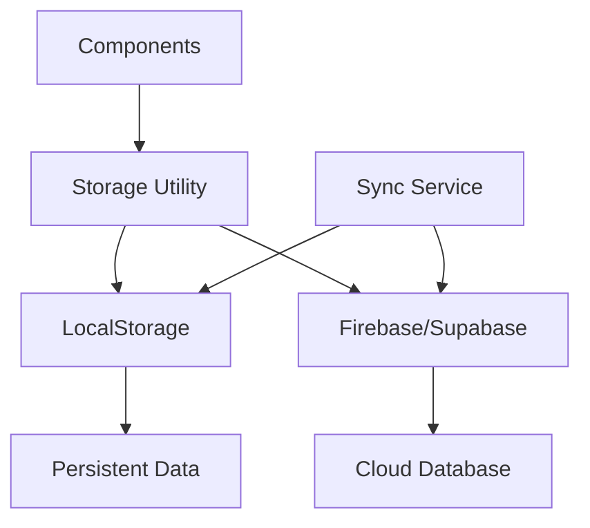

# ATaskPrompt Data Model and Storage Plan

## Data Models

### Task Model

The Task model represents a single task in the system.

```javascript
{
  // Unique identifier for the task
  id: string,
  
  // The text content of the task
  text: string,
  
  // Category for organizing tasks (e.g., "Health", "Work", "Personal")
  category: string,
  
  // Whether the task has been completed
  completed: boolean,
  
  // When the task was created
  createdAt: Date,
  
  // When the task was completed (null if not completed)
  completedAt: Date | null,
  
  // Whether the task has been shown in a prompt
  prompted: boolean,
  
  // How many times the task has been prompted
  promptCount: number,
  
  // How many times the task has been completed
  completionCount: number,
  
  // Location name where the task should be performed (optional)
  locationName: string | null,
  
  // Location coordinates where the task should be performed (optional)
  locationCoords: {
    latitude: number,
    longitude: number
  } | null,
  
  // Icon identifier for display (optional)
  icon: string | null
}
```

### Trophy Model

The Trophy model represents achievements earned by the user.

```javascript
{
  // Unique identifier for the trophy
  id: string,
  
  // Name of the trophy
  name: string,
  
  // Description of how the trophy was earned
  description: string,
  
  // When the trophy was earned
  earnedAt: Date,
  
  // Icon identifier for display
  icon: string,
  
  // Category of the trophy (e.g., "Completion", "Streak", "Variety")
  category: string,
  
  // Associated task information (optional)
  associatedTask: {
    // Task identifier
    id: string,
    
    // Task text content
    text: string,
    
    // Task category
    category: string,
    
    // When the task was created
    createdAt: Date,
    
    // When the task was completed
    completedAt: Date,
    
    // Location name where the task was performed (optional)
    locationName: string | null,
    
    // How many times the task has been prompted
    promptCount: number,
    
    // How many times the task has been completed
    completionCount: number
  } | null
}
```

### User Settings Model

The User Settings model stores user preferences and configuration.

```javascript
{
  // User-defined task categories
  categories: Array<{
    id: string,
    name: string,
    color: string
  }>,
  
  // Prompt frequency settings
  promptFrequency: {
    // Minimum time between prompts (in minutes)
    minInterval: number,
    
    // Maximum time between prompts (in minutes)
    maxInterval: number,
    
    // Whether to prompt during specific hours
    timeRestrictions: {
      enabled: boolean,
      startTime: string, // "HH:MM" format
      endTime: string    // "HH:MM" format
    }
  },
  
  // Reward preferences
  rewards: {
    // Whether to show confetti
    confettiEnabled: boolean,
    
    // Whether to play sounds
    soundEnabled: boolean,
    
    // Volume level (0-1)
    volume: number,
    
    // Selected sound pack
    soundPack: string
  },
  
  // Accessibility settings
  accessibility: {
    // Larger text size
    largeText: boolean,
    
    // High contrast mode
    highContrast: boolean,
    
    // Reduced animations
    reducedMotion: boolean
  }
}
```

### Task History Model

The Task History model tracks completed tasks for analytics.

```javascript
{
  // Reference to the task ID
  taskId: string,
  
  // When the task was completed
  completedAt: Date,
  
  // How long it took to complete (in minutes)
  duration: number,
  
  // User mood when completing (if provided)
  mood: string,
  
  // Any notes added by user
  notes: string
}
```

## Storage Approach

### Phase 1: Local Storage (Solo Mode)

For the initial MVP, we'll use the browser's LocalStorage API for data persistence.

#### Storage Structure

```
localStorage keys:
- 'ataskprompt_tasks': JSON string of tasks array
- 'ataskprompt_trophies': JSON string of trophies array
- 'ataskprompt_settings': JSON string of user settings object
- 'ataskprompt_history': JSON string of task history array
- 'ataskprompt_lastPrompt': ISO string of last prompt time
```

#### Storage Utility Functions (storage.js)

```javascript
// Save tasks to localStorage
saveTasks(tasks)

// Load tasks from localStorage
loadTasks()

// Save trophies to localStorage
saveTrophies(trophies)

// Load trophies from localStorage
loadTrophies()

// Save settings to localStorage
saveSettings(settings)

// Load settings from localStorage
loadSettings()

// Save history to localStorage
saveHistory(history)

// Load history from localStorage
loadHistory()

// Save last prompt time
saveLastPromptTime(time)

// Load last prompt time
loadLastPromptTime()
```

### Phase 2: Cloud Storage (Multi-user Mode)

For the shared mode, we'll implement cloud storage using Firebase or Supabase.

#### Database Schema

**Tasks Table**
```
id: string (primary key)
user_id: string (foreign key to Users)
text: string
category: string
completed: boolean
created_at: timestamp
completed_at: timestamp (nullable)
prompted: boolean
prompt_count: integer
completion_count: integer
location_name: string (nullable)
location_coords: json (nullable)  // {latitude: number, longitude: number}
icon: string (nullable)
```

**Trophies Table**
```
id: string (primary key)
user_id: string (foreign key to Users)
name: string
description: string
earned_at: timestamp
icon: string
category: string
```

**Users Table**
```
id: string (primary key)
email: string (unique)
display_name: string
created_at: timestamp
```

**User Settings Table**
```
user_id: string (primary key, foreign key to Users)
categories: json
prompt_frequency: json
rewards: json
accessibility: json
```

**Task History Table**
```
id: string (primary key)
task_id: string (foreign key to Tasks)
user_id: string (foreign key to Users)
completed_at: timestamp
duration: integer
mood: string
notes: string
```

## Data Flow Diagram



## Synchronization Strategy

### Local-First Approach

1. All operations are performed locally first for immediate feedback
2. Changes are queued for synchronization with cloud storage
3. Conflict resolution prioritizes latest timestamp
4. Offline operations are stored in a pending queue

### Sync Process

```javascript
// When online status changes
onOnlineStatusChange(isOnline)

// When data changes locally
onLocalDataChange(data)

// When data changes remotely
onRemoteDataChange(data)

// Sync pending changes
syncPendingChanges()

// Resolve conflicts
resolveConflicts(localData, remoteData)
```

## Performance Considerations

### Local Storage Optimization

1. **Data Chunking**: Large arrays are split into smaller chunks
2. **Compression**: Frequently accessed data is compressed
3. **Indexing**: Quick lookup indices for categories and dates
4. **Caching**: Frequently accessed data is cached in memory

### Cloud Storage Optimization

1. **Pagination**: Large datasets are paginated
2. **Indexing**: Database indices on frequently queried fields
3. **Caching**: CDN caching for static assets
4. **Batch Operations**: Multiple operations are batched

## Security Considerations

### Local Storage

1. **Data Encryption**: Sensitive data is encrypted before storage
2. **Access Control**: Storage access is limited to utility functions
3. **Validation**: All data is validated before storage

### Cloud Storage

1. **Authentication**: All requests are authenticated
2. **Authorization**: Role-based access control
3. **Data Validation**: Server-side validation of all data
4. **Audit Logging**: All data changes are logged