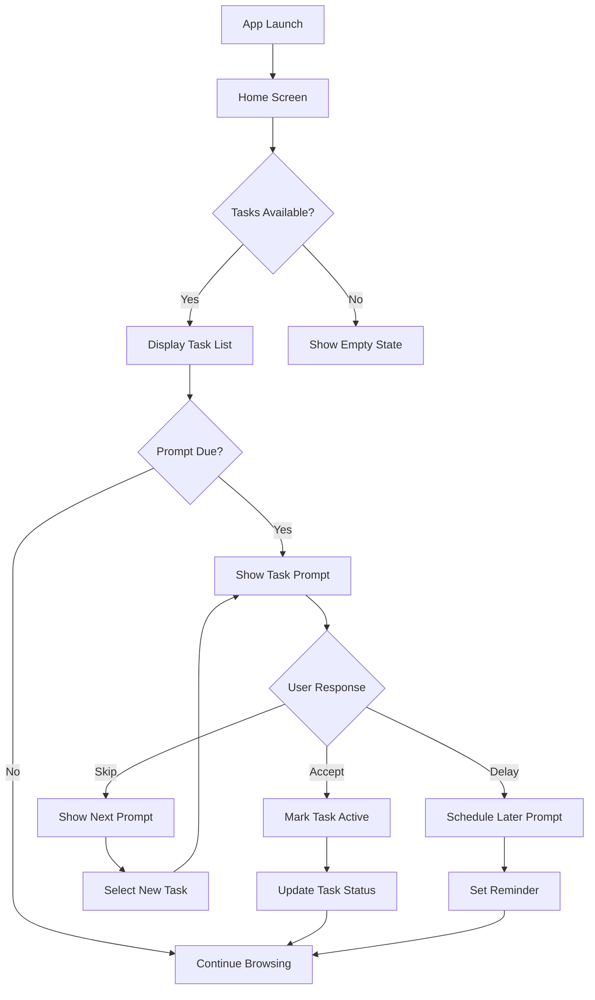
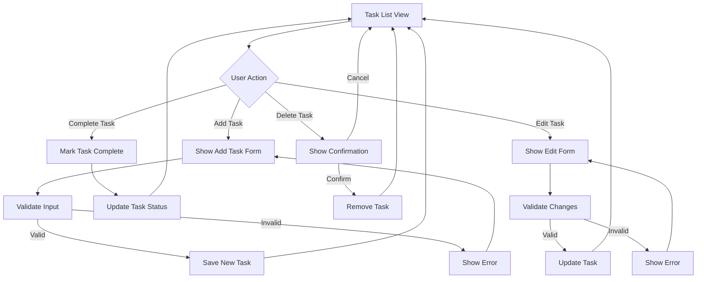
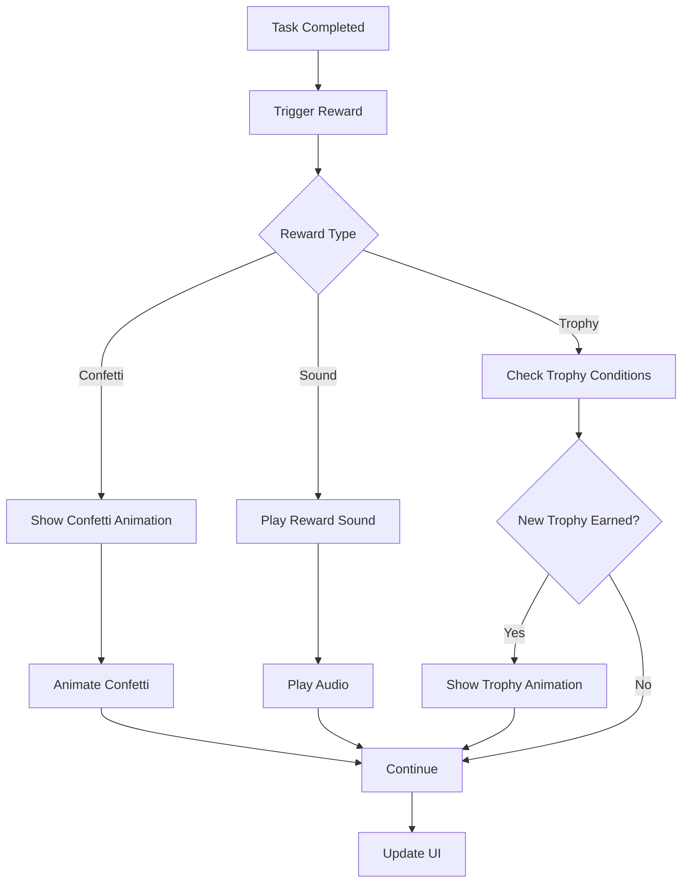

# ATaskPrompt UI/UX Design

## Design Principles

### 1. Positive Phrasing
All UI elements use encouraging, positive language to motivate users rather than create pressure or anxiety.

### 2. Minimal Distractions
Clean, uncluttered interface with focus on core functionality. No unnecessary elements that could overwhelm users with ADHD.

### 3. Clear Visual Feedback
Immediate, obvious feedback for all user actions to reinforce positive behavior.

### 4. Accessibility First
Designed with accessibility in mind, supporting screen readers, keyboard navigation, and various visual needs.

### 5. Mobile-First Responsive Design
Optimized for mobile devices while maintaining functionality on larger screens.

## Color Palette

### Primary Colors
- **Primary**: #4CAF50 (Green) - Success, positive actions
- **Secondary**: #2196F3 (Blue) - Neutral actions, information
- **Accent**: #FF9800 (Orange) - Warnings, attention

### Status Colors
- **Completed**: #4CAF50 (Green)
- **Pending**: #FFC107 (Yellow)
- **Overdue**: #F44336 (Red)
- **New**: #2196F3 (Blue)

### Background Colors
- **Light Mode**: #FFFFFF (White)
- **Dark Mode**: #121212 (Dark Gray)
- **Card Background**: #F5F5F5 (Light Gray) / #1E1E1E (Dark Gray)

## Typography

### Font Family
- **Primary**: 'Open Sans' - Clean, readable sans-serif
- **Secondary**: 'Roboto' - For headings and emphasis

### Font Sizes
- **Headings**: 1.5rem (24px)
- **Subheadings**: 1.25rem (20px)
- **Body Text**: 1rem (16px)
- **Small Text**: 0.875rem (14px)
- **Captions**: 0.75rem (12px)

## UI Components

### 1. Task Card

```
+-------------------------------------+
| [Category Tag]              [Menu]  |
|                                     |
| 📚 Task description text goes here  |
| and can wrap to multiple lines      |
|                                     |
|              |
|                                     |
| [← Previous] [Complete] [Next →]    |
+-------------------------------------+
```

**Elements**:
- Category tag with color coding
- Task description text

- Icon (if specified)
- Navigation buttons (Previous Task, Next Task, Complete)
- Menu button for additional options

### 2. Task Prompt Modal

```
+-------------------------------------+
|                                     |
|    🌟 Do you feel like doing 🌟     |
|                                     |
|  "Take a 5-minute walk outside"     |
|                                     |
|  [Sounds Fun!]  [Not Now]  [Later]  |
|                                     |
+-------------------------------------+
```

**Note**: The header alternates between "Do you feel like doing" and "Want to do" every 3 seconds.

**Elements**:
- Encouraging header text
- Task description with positive phrasing
- Action buttons with positive labels
- Visual emphasis on the task

### 3. Trophy Card

```
+-------------------------------------+
|  🏆  First Completion               |
|                                     |
|  You completed your first task!     |
|                                     |
|  Earned: Today at 2:30 PM           |
+-------------------------------------+
```

**Elements**:
- Trophy icon
- Trophy name
- Achievement description
- Date earned

### 4. Progress Indicator

```
[●●●○○] 3/5 tasks completed today
```

**Elements**:
- Visual progress dots
- Numerical progress
- Encouraging text

## User Flow Diagrams

### 1. Main Dashboard Flow



### 2. Task Management Flow



### 3. Reward Flow



## Screen Designs

### 1. Home Screen

```
+-------------------------------------+
| ATaskPrompt                   [⚙️]  |
+-------------------------------------+
| [Today: 3/5 tasks]                  |
|                                     |
| 🌟 Do you feel like doing           |
| "Take a 5-minute walk outside"      |
| [Sounds Fun!]  [Not Now]            |
|                                     |
| Things I Want to Do:                         |
| +---------------------------------+ |
| | [Health] Drink water          ✓ | |
| |                                 | |
| | [Work]   Reply to emails      ✓ | |
| |                                 | |
| | [Personal] Call mom           ○ | |
| +---------------------------------+ |
|                                     |
| [+ Add Task]                        |
+-------------------------------------+
| [🏠 Home] [📊 History] [🏆 Trophies] |
+-------------------------------------+
```

### 2. Task List Screen

```
+-------------------------------------+
| Things I Want to Do                    [⚙️]  |
+-------------------------------------+
| Filter: [All ▼] [Health] [Work]     |
|                                     |
| +---------------------------------+ |
| | [Health] 📚 Drink water       ✓ | |
| |          | |
| | [Complete] [Skip] [Delay]       | |
| +---------------------------------+ |
|                                     |
| +---------------------------------+ |
| | [Work]   💼 Reply to emails   ✓ | |
| | [Complete] [Skip] [Delay]       | |
| +---------------------------------+ |
|                                     |
| +---------------------------------+ |
| | [Personal] 👤 Call mom        ○ | |
| | [Complete] [Skip] [Delay]       | |
| +---------------------------------+ |
|                                     |
| +---------------------------------+ |
| | [Home] 🏠 Tidy living room    ○ | |
| | [Complete] [Skip] [Delay]       | |
| +---------------------------------+ |
|                                     |
| +---------------------------------+ |
| | [Cleaning] 🧹 Clean kitchen   ○ | |
| | [Complete] [Skip] [Delay]       | |
| +---------------------------------+ |
|                                     |
| [+ Add Task]                        |
| Category: [Health ▼]                |
| Icon: [📚 book ▼]                   |

| Name: [___________________________] |
+-------------------------------------+
| [🏠 Home] [📊 History] [🏆 Trophies] |
+-------------------------------------+
```

### 3. Task Prompt Screen

```
+-------------------------------------+
|                                     |
|    🌟 Do you feel like doing 🌟     |
|                                     |
|                                     |
|   📚 "Take a 5-minute walk outside" |
|                                     |
|      |
|                                     |
|      [Sounds Fun!]  [Not Now]       |
|                                     |
|              [Later]                 |
|                                     |
|                                     |
+-------------------------------------+
```

**Note**: The header alternates between "Do you feel like doing" and "Want to do" every 3 seconds.

### 4. Trophy Board Screen

```
+-------------------------------------+
| Your Trophies                 [⚙️]  |
+-------------------------------------+
| 🏆 First Completion                 |
| You completed your first task!      |
| Earned: Today at 2:30 PM            |
|                                     |
| 🏆 Consistency Starter              |
| You completed tasks for 3 days!     |
| Earned: Yesterday at 5:15 PM        |
|                                     |
| 🏆 Variety Seeker                   |
| You completed 5 different tasks!    |
| Earned: Aug 8 at 10:45 AM           |
|                                     |
| [+] More trophies coming soon...    |
+-------------------------------------+
| [🏠 Home] [📊 History] [🏆 Trophies] |
+-------------------------------------+
```

### 5. History Screen

```
+-------------------------------------+
| Task History                  [⚙️]  |
+-------------------------------------+
| Filter: [Last 7 Days ▼]             |
|                                     |
| Aug 10, 2025                        |
| ✓ Drink water (10:30 AM)            |
| ✓ Reply to emails (2:15 PM)         |
|                                     |
| Aug 9, 2025                         |
| ✓ Call mom (4:20 PM)                |
| ✓ Take vitamins (9:00 AM)           |
|                                     |
| Aug 8, 2025                         |
| ✓ Morning stretch (8:30 AM)         |
+-------------------------------------+
| [🏠 Home] [📊 History] [🏆 Trophies] |
+-------------------------------------+
```

### 6. Settings Screen

```
+-------------------------------------+
| Settings                      [⚙️]  |
+-------------------------------------+
| Prompt Frequency                    |
| [Every 30-60 minutes ▼]             |
|                                     |
| Categories                          |
| [Health] [Work] [Personal] [Home] [Cleaning] [+] |
|                                     |

|                                     |
| Rewards                             |
| [✓ Confetti] [✓ Sounds]             |
| Volume: [█████░░░░░] 50%            |
|                                     |
| Accessibility                       |
| [Large Text] [High Contrast]        |
|                                     |
| [Reset to Defaults]                 |
+-------------------------------------+
| [🏠 Home] [📊 History] [🏆 Trophies] |
+-------------------------------------+
```

## Responsive Design

### Mobile Layout (320px - 480px)
- Single column layout
- Larger touch targets (minimum 44px)
- Simplified navigation
- Full-width buttons

### Tablet Layout (481px - 768px)
- Two column layout for task list
- More information per screen
- Enhanced filtering options

### Desktop Layout (769px+)
- Three column layout
- Advanced filtering and sorting
- Keyboard shortcuts
- Multi-window support

## Accessibility Features

### Visual
- High contrast mode
- Large text option
- Colorblind-friendly palette
- Reduced motion option

### Navigation
- Full keyboard navigation
- Screen reader support
- Focus indicators
- Skip links

### Cognitive
- Consistent interface patterns
- Clear labeling
- Undo functionality
- Progressive disclosure

## Animation Guidelines

### Micro-interactions
- Button hover effects (subtle color change)
- Task completion animation (checkmark)
- Page transitions (slide effects)

### Reward Animations
- Confetti (5 seconds max)
- Trophy reveal (3 seconds)
- Progress indicators (smooth transitions)

### Performance
- All animations under 300ms
- Reduced motion option disables non-essential animations
- Hardware acceleration for smooth performance

## User Onboarding

### First Launch
1. Welcome screen with app purpose
2. Quick tutorial of main features
3. Initial category setup
4. Prompt frequency selection

### Progressive Disclosure
- Introduce advanced features gradually
- Contextual tips based on usage
- Achievement-based unlocks

## Error Handling

### Validation Errors
- Clear error messages
- Visual highlighting of problematic fields
- Suggested corrections

### System Errors
- Friendly error messages
- Recovery options
- Contact support option

### Offline States
- Clear offline indicator
- Cached data availability
- Sync status when reconnected